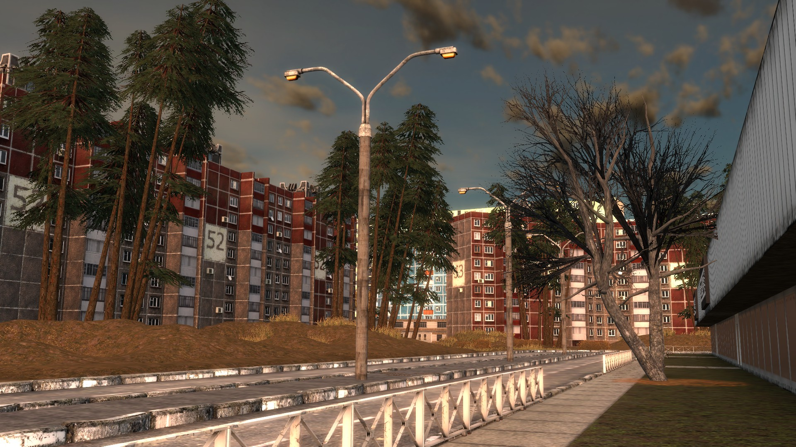
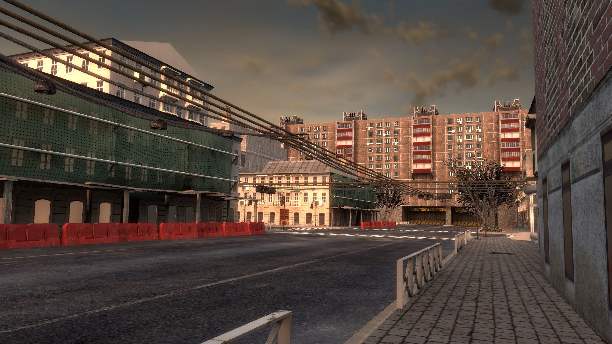
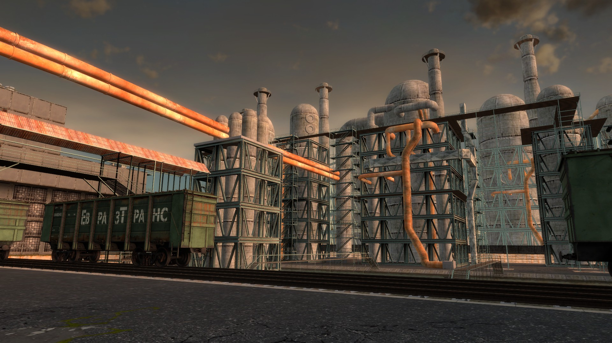
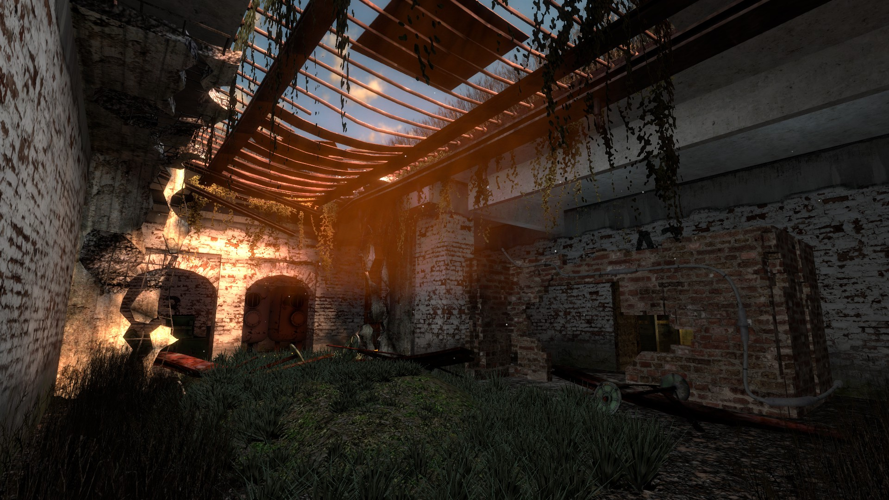

<p align="center">
	
</p>

<p align="center">
	
</p>

<p align="center">
	
</p>

<p align="center">
	
</p>

# gm_post_ussr

A comprehensive Garry's Mod map project featuring immersive post-Soviet environments with custom assets, entities, and certain gameplay systems.

## Features

- **Custom Map**: Complete VMF files for the main map and surrounding areas
- **Extensive Asset Library**: Hundreds of custom textures and models for industrial, urban, and decayed environments
- **Lua Systems**:
  - Trigger and point systems for interactive gameplay elements
  - Named entities system for advanced map logic
  - Callback systems for client-server communication
  - Auto-exposure changer for dynamic tonemapping
  - Delay tool for timed events

*As a result those Lua systems were only used to make some briefcases and certain entities, I had bigger plans for that surely...*

- **Custom Entities**:
  - Damage triggers with helper entities
  - Use triggers with helper entities
  - Point system entities for map navigation and logic

- **Complete Skybox**: Custom post-Soviet themed skybox textures

## Project Structure

- `gm_post_ussr/` - Main addon folder with Lua scripts and FGD file
- `materials/` - All custom textures organized by type (correction, decals, map, props, skybox, sprite)
- `models/` - Compiled model files (.mdl, .vtx, .vvd, .phy)
- `ProjectSetup/` - Build scripts for textures and models
- `VMF/` - Source map files for Hammer Editor
- `spawnicons/` - Icon images for model browser

## Installation

1. Download the repository
2. Extract to your Garry's Mod addons folder (`garrysmod/addons/`)
3. Ensure all folders maintain their structure
4. Launch Garry's Mod and load the map

## Development

The project includes extensive build scripts in the `ProjectSetup` directory for compiling textures and models. The Python scripts automate the texture building process and QC file generation for models.

## Requirements

- Garry's Mod
- Hammer Editor (for map editing)

---

# How to Use ProjectSetup

The ProjectSetup folder contains automated build scripts for compiling textures and models for the gm_post_ussr project. Here's how to use each component:

## Quick Start

### Build Everything at Once
Double-click `build_everything_asap.bat` or run:
```bash
python build_anything_asap.py
```
This will start a file watcher that automatically rebuilds textures and models whenever source files are modified.

### Manual Build Options

#### Build All Textures
Run `build_textures.bat` which will sequentially build:
- Prop textures
- Map textures  
- Decal textures
- Sprite textures

#### Build All Models
Run `build_models.bat` which will:
1. Generate QC files from SMD files
2. Compile models using studiomdl

#### Create QC Files Only
Run `create_models_qc.bat` to generate QC files without compiling models.

## Detailed Process

### For Textures
1. Place your source texture files (TGA format) in the appropriate folders:
   - `0_DecalTextures/` - For decal textures
   - `0_MapTextures/` - For map brush textures
   - `0_PropTextures/` - For model textures
   - `0_SpriteTextures/` - For sprite textures
   - `3_SkyboxTextures/` - For skybox textures

2. Name your textures with appropriate suffixes:
   - `_D.tga` - Diffuse map
   - `_N.tga` - Normal map
   - `_E.tga` - Emissive map
   - `_G` - Glossiness flag (empty file)
   - `_DAT.tga` - Diffuse with alpha/translucent

3. Run the appropriate build script - it will:
   - Convert TGA files to VTF format
   - Generate VMT material files
   - Track file modification times to avoid rebuilding unchanged files

### For Models
1. Place your SMD files in `1_PropExport/`
2. Name files appropriately:
   - `modelname.smd` - Main model
   - `modelname_Phys.smd` - Physics mesh (optional)
   - `modelname_LODxxx.smd` - LOD models (optional, where xxx is distance threshold)

3. Run `create_models_qc.py` to generate QC files
4. Run `build_qc.py` to compile models

### Automatic Building
The `build_anything_asap.py` script monitors all folders and automatically triggers rebuilds when source files change.

## Requirements

- VTFCmd.exe (path configured in batch files - currently set to `G:/Other Stuff/Archive/MapTextures/apps/VTFCmd/VTFCmd.exe`)
- Studiomdl.exe (path configured - currently set to Garry's Mod installation)
- Python 3.x installed

# ProjectSetup - Where to Change Paths to Make It Work

You need to update paths in the following files. All paths are currently hardcoded to `G:/Other Stuff/...` which likely doesn't exist on your system.

## 1. Update VTFCmd Paths (in all VTFCmd.bat files)

Edit these files to point to your VTFCmd.exe location:
- `0_DecalTextures/VTFCmd.bat`
- `0_DecalTextures/VTFCmdAlpha.bat`
- `0_MapTextures/VTFCmd.bat`
- `0_MapTextures/VTFCmdAlpha.bat`
- `0_PropTextures/VTFCmd.bat`
- `0_PropTextures/VTFCmdAlpha.bat`
- `0_SpriteTextures/VTFCmd.bat`
- `0_SpriteTextures/VTFCmdAlpha.bat`
- `3_SkyboxTextures/VTFCmd.bat`

Change this line in each file:
```batch
"G:\Other Stuff\Archive\MapTextures\apps\VTFCmd\VTFCmd.exe" -file %1 -output %2
```

To something like (adjust to your actual VTFCmd location):
```batch
"C:\Program Files\VTFCmd\VTFCmd.exe" -file %1 -output %2
```

## 2. Update studiomdl Path

Edit `1_PropExport/studiomdl.bat`:
```batch
"G:/Other Stuff/Games/SteamLibrary/steamapps/common/GarrysMod/bin/studiomdl" -game "G:/Other Stuff/Games/SteamLibrary/steamapps/common/GarrysMod/garrysmod" -nop4 %1
```

Change to your Garry's Mod installation path, for example:
```batch
"C:\your\path\to\Steam\steamapps\common\GarrysMod\bin\studiomdl" -game "C:\your\path\to\steamapps\common\GarrysMod\garrysmod" -nop4 %1
```

## 3. Update Source Paths in Python Files

Each Python file has a `path` variable at the top that needs updating. Edit these files:

**Replace `C:/path/to/` with a path to your Steam or gm_post_ussr directory**

### `0_DecalTextures/build_textures.py`
```python
path = "G:/Other Stuff/Archive/ModelStuff/gm_post_ussr/0_DecalTextures"
path_to_export_textures = "G:/Other Stuff/Games/SteamLibrary/steamapps/common/GarrysMod/garrysmod/materials/gm_post_ussr/decal"
```

Change to:
```python
path = "C:/path/to/gm_post_ussr/ProjectSetup/0_DecalTextures"
path_to_export_textures = "C:/path/to/Steam/steamapps/common/GarrysMod/garrysmod/materials/gm_post_ussr/decal"
```

### `0_MapTextures/build_textures.py`
```python
path = "G:/Other Stuff/Archive/ModelStuff/gm_post_ussr/0_MapTextures"
path_to_export_textures = "G:/Other Stuff/Games/SteamLibrary/steamapps/common/GarrysMod/garrysmod/materials/gm_post_ussr/map"
```

Change to:
```python
path = "C:/path/to/gm_post_ussr/ProjectSetup/0_MapTextures"
path_to_export_textures = "C:/path/to/Steam/steamapps/common/GarrysMod/garrysmod/materials/gm_post_ussr/map"
```

### `0_PropTextures/build_textures.py`
```python
path = "G:/Other Stuff/Archive/ModelStuff/gm_post_ussr/0_PropTextures"
path_to_export_textures = "G:/Other Stuff/Games/SteamLibrary/steamapps/common/GarrysMod/garrysmod/materials/gm_post_ussr/props"
```

Change to:
```python
path = "C:/path/to/gm_post_ussr/ProjectSetup/0_PropTextures"
path_to_export_textures = "C:/path/to/Steam/steamapps/common/GarrysMod/garrysmod/materials/gm_post_ussr/props"
```

### `0_SpriteTextures/build_textures.py`
```python
path = "G:/Other Stuff/Archive/ModelStuff/gm_post_ussr/0_SpriteTextures"
path_to_export_textures = "G:/Other Stuff/Games/SteamLibrary/steamapps/common/GarrysMod/garrysmod/materials/gm_post_ussr/sprite"
```

Change to:
```python
path = "C:/path/to/gm_post_ussr/ProjectSetup/0_SpriteTextures"
path_to_export_textures = "C:/path/to/Steam/steamapps/common/GarrysMod/garrysmod/materials/gm_post_ussr/sprite"
```

### `3_SkyboxTextures/build_textures.py`
```python
path = "G:/Other Stuff/Archive/ModelStuff/gm_post_ussr/3_SkyboxTextures"
path_to_export_textures = "G:/Other Stuff/Games/SteamLibrary/steamapps/common/GarrysMod/garrysmod/materials/skybox"
```

Change to:
```python
path = "C:/path/to/gm_post_ussr/ProjectSetup/3_SkyboxTextures"
path_to_export_textures = "C:/path/to/Steam/steamapps/common/GarrysMod/garrysmod/materials/gm_post_ussr/skybox"
```

### `1_PropExport/build_qc.py` and `1_PropExport/create_qc.py`
```python
path = "G:/Other Stuff/Archive/ModelStuff/gm_post_ussr/1_PropExport"
```

Change to:
```python
path = "C:/path/to/gm_post_ussr/ProjectSetup/1_PropExport"
```

## Quick Summary of Changes Needed:

1. **VTFCmd paths** in all `.bat` files in texture folders
2. **studiomdl path** in `1_PropExport/studiomdl.bat`
3. **Source paths** at the top of all Python `build_textures.py` files
4. **Model export path** in `1_PropExport` Python files

After making these changes, you should be able to run the build scripts successfully.
